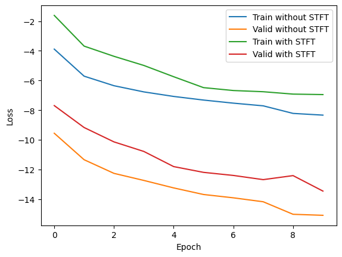
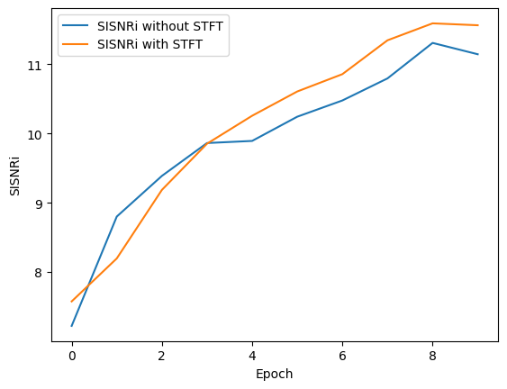

# SVoice: Speaker Voice Separation using Neural Nets

I reproduced the paper of ICML 2020, "[Voice Separation with an Unknown Number of Multiple Speakers][icml]" and propose a new method based on it for separating audio sequences with multiple speakers.The structure of my model is based on the bidirectional LSTM structure in the original paper, but I add a new multi-resolution short-time Fourier transform loss to the original model to finally separate out audio with multiple channels to represent different speakers.

Due to computational limitations, I only trained the model for two speakers and used a smaller number of parameters than the original author. However, experiments show that the proposed method improves the SI-SNRi value of the model by 0.3.

Demos of the model can be found in [results](results).


## Installation

First, install Python 3.7 (recommended with Anaconda).


```bash
git clone git@github.com:fairinternal/svoice.git
pip install torch==1.6.0+cu101 torchvision==0.7.0+cu101 -f https://download.pytorch.org/whl/torch_stable.html
pip install -r requirements.txt  
```

## Setup

### Configuration

I use [Hydra][hydra] to control all the training configurations. If you are not familiar with Hydra
we recommend visiting the Hydra [website][hydra-web].
Generally, Hydra is an open-source framework that simplifies the development of research applications
by providing the ability to create a hierarchical configuration dynamically.

The config file with all relevant arguments for training our model can be found under the `conf` folder.
Notice, under the `conf` folder, the `dset` folder contains the configuration files for
the different datasets that you maybe want to use. You should see a file named `config.yaml` with the relevant configuration for the debug sample set.

You can pass options through the
command line, for instance `python train.py lr=1e-4`.
Or you can also directly edit the `config.yaml` file, although this is not recommended
due to the way experiments are automatically named, as explained hereafter.

### Checkpointing

Each experiment will get a unique name based on the command line options you passed. Go to config.yaml and change the `Hydra config` field to the name you want to use for your experiment.
Restarting the same command will *** reuse the existing folder and automatically start from a previous checkpoint *** if possible. In order to ignore previous checkpoints, you must pass the `restart=1` option.

### Setting up a new dataset

If you want to train using a new dataset, you can:
1. Create a separate config file for it.
2. Place the new config files under the `dset` folder. Check [conf/dset/debug.yaml](conf/dset/debug.yaml)
for more details on configuring your dataset.
3. Point to it either in the general config file `config.yaml` or via the command line, e.g. `./train.py dset=name_of_dset`.

You also need to generate the relevant `.json`files in the `egs/`folder.
For that purpose you can use the `python -m svoice.data.audio` command that will
scan the given folders and output the required metadata as json.
For instance, if your mixture files are located in `$mix` and the separated files are in `$spk1` and `$spk2`, you can do

```bash
out=egs/mydataset/tr
mkdir -p $out
python -m svoice.data.audio $mix > $out/mix.json
python -m svoice.data.audio $spk1 > $out/s1.json
python -m svoice.data.audio $spk1 > $out/s1.json
```

## Usage
### Quick Start with Toy Example
1. Run `./make_debug.sh` to generate json files for the toy dataset.
2. Run `python train.py`

Notice, we already provided the yaml file for it. Can be found under `conf/dset/debug.yaml`.

### Data Structure
The data loader reads both mixture and separated json files named: `mix.json` and `s<id>.json` where `<id>` is a running identifier. These files should contain all the paths to the wav files to be used to optimize and test the model along with their size (in frames).
You should generate the above files for both training and test sets (and validation set if provided). Once this is done, you should create a yaml (similarly to `conf/dset/debug.yaml`) with the dataset folders' updated paths.
You can download part of the WSJ0-2mix dataset from [here][https://docs.google.com/presentation/d/1lskmHkti5tJjRvrl03mhuh_aMwfGA4M2Heayk5hL054/edit#slide=id.g80fe64a690_0_75], which is uploaded by Prof. Hongyi Li, Taiwan University.

### Training
Training is simply done by launching the `train.py` script:

```
python train.py
```

This will automaticlly read all the configurations from the `conf/config.yaml` file. You can override different configuration arguments from the command, this will automaticlly generate new folder using the override params.
```
python train.py lr=0.001
python train.py dset=librimix lr=0.001 swave.R=8
```

#### Distributed Training

To launch distributed training you should turn on the distributed training flag. This can be done as follows:

```
python train.py ddp=1
```

#### Logs

Logs are stored by default in the `outputs` folder. Look for the matching experiment name.
In the experiment folder you will find the training checkpoint `checkpoint.th` (containing the last state as well as the best state)
as well as the log with the metrics `trainer.log`. All metrics are also extracted to the `history.json`
file for easier parsing. Enhancements samples are stored in the `samples` folder (if `mix_dir` or `mix_json`
is set in the dataset config yaml file).

### Evaluating

Evaluating the models can be done by launching the following:

```
python -m svoice.evaluate <path to the model> <path to folder containing mix.json and all target separated channels json files s<ID>.json>
```

For more details regarding possible arguments, please see:

```
usage: Evaluate separation performance using MulCat blocks [-h]
                                                           [--device DEVICE]
                                                           [--sdr SDR]
                                                           [--sample_rate SAMPLE_RATE]
                                                           [--num_workers NUM_WORKERS]
                                                           [-v]
                                                           model_path data_dir

positional arguments:
  model_path            Path to model file created by training
  data_dir              directory including mix.json, s1.json, s2.json, ...
                        files

optional arguments:
  -h, --help            show this help message and exit
  --device DEVICE
  --sdr SDR
  --sample_rate SAMPLE_RATE
                        Sample rate
  --num_workers NUM_WORKERS
  -v, --verbose         More loggging
```

### Separation

Separating files can be done by launching the following:

```
python -m svoice.separate <path to the model> <path to store the separated files> --mix_dir=<path to the dir with the mixture files>
```

Notice, you can either provide `mix_dir` or `mix_json` for the test data.
For more details regarding possible arguments, please see:

```
usage: Speech separation using MulCat blocks [-h] [--mix_dir MIX_DIR]
                                             [--mix_json MIX_JSON]
                                             [--device DEVICE]
                                             [--sample_rate SAMPLE_RATE]
                                             [--batch_size BATCH_SIZE] [-v]
                                             model_path out_dir

positional arguments:
  model_path            Model name
  out_dir               Directory putting enhanced wav files

optional arguments:
  -h, --help            show this help message and exit
  --mix_dir MIX_DIR     Directory including mix wav files
  --mix_json MIX_JSON   Json file including mix wav files
  --device DEVICE
  --sample_rate SAMPLE_RATE
                        Sample rate
  --batch_size BATCH_SIZE
                        Batch size
  -v, --verbose         More loggging
```


## Results 
Using the default configuration (same one as presented in our [paper][arxiv]), results should be similar to the following. 
All reprted numbers are the Scale-Invariant Signal-to-Noise-Ratio improvment (SI-SNRi) over the input mixture.

| Model            | #params | SI-SNRi |
|------------------|---------|---------|
| ADANet           | 9.1M    | 10.5    |
| DPCL++           | 13.6M   | 10.8    |
| CBLDNN-GAT       | 39.5M   | 11      |
| TasNet           | 32.0M   | 11.2    |
| ConvTasNet       | 5.1M    | 15.3    |
| 原文             | 7.5M    | 20.1    |
| 本文复现         | 4.8M    | 11.3    |
| 复现+MRSTFT loss | 4.8M    | 11.6    |


#### Learning Curves 
The following learning cures were obtained using L=8 (the encoder kernel size): 

<p align="center">


</p>

[icml]: https://arxiv.org/abs/2003.01531.pdf
[icassp]: https://arxiv.org/pdf/2011.02329.pdf
[web]: https://enk100.github.io/speaker_separation/
[pytorch]: https://pytorch.org/
[hydra]: https://github.com/facebookresearch/hydra
[hydra-web]: https://hydra.cc/
[convtas]: https://github.com/kaituoxu/Conv-TasNet 
[convtas-paper]: https://arxiv.org/pdf/1809.07454.pdf
[tac]: https://github.com/yluo42/TAC
[nprirgen]: https://github.com/ty274/rir-generator
[rir]:https://asa.scitation.org/doi/10.1121/1.382599
